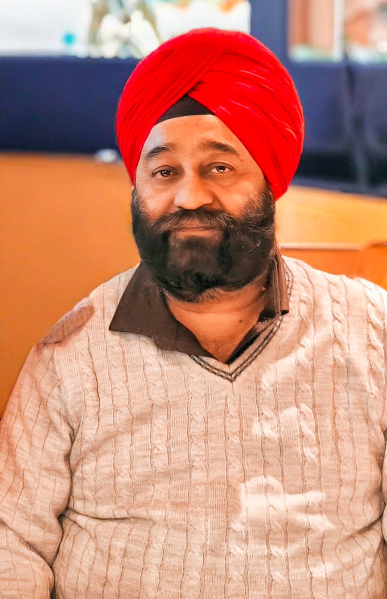

# In Loving Memory of Gurdeep Singh Saluja  

**Passed Away: March 10, 2025**  
Due to medical negligence at Ganga Ram Hospital, Delhi, India.

This page is dedicated to my father, Gurdeep Singh Saluja. A kind, loving, and resilient man whose life was tragically cut short due to the negligence and mishandling of medical professionals at [Sir Ganga Ram Hospital](https://sgrh.com/), under the care of [Dr. Suresh Singhvi](https://sgrh.com/doctor-details/institute-of-surgical-gastroenterology-gi-and-hpb-onco-surgery-and-liver-transplantation/suresh-singhvi).

## What Happened

On **January 8, 2025**, my father was admitted for a routine gallbladder stone operation. The surgery was performed by Dr. Suresh Singhvi.

- **January 9**: He was kept in the ICU.  
- **January 10**: He was shifted to the ward. From this point onward, the main surgeon did not visit him again.  
  - Only a junior doctor came and casually said to "keep giving him water."  
  That night, my father started experiencing **severe abdominal pain** — no doctor attended to him.

- **January 11**: Dr. Singhvi finally showed up. By then, a **severe infection had spread throughout my father's body**.  
  - A monitor and other emergency equipment were brought in.

  - A CT scan revealed that **a nerve in the small intestine had been accidentally cut and stitched up during the initial surgery**, without proper correction.  
  My father was rushed into a **second surgery** the same day and placed on a **ventilator** afterwards.

Other doctors, including **Dr. Prem** and **Dr. Nikhil**, were also involved. Despite clear signs of internal bleeding and complications (including bleeding from the stomach bag), **they continued to ignore the seriousness of his condition**.

Over the next **two months**, my father suffered tremendously. His abdomen had been completely opened — something I cannot even show publicly due to the trauma and condition he was in.

On **March 9, 2025**, after the hospital received the full payment, we were informed that **"he cannot be saved."**  
Just a day later, on **March 10, 2025**, my father passed away.

---

## Why This Page Exists

We are sharing this story to raise awareness about medical negligence and to hold those accountable who failed my father. What happened to him should **never** happen to another person or family again.

I sincerely request your support in helping us seek **justice** for Gurdeep Singh Saluja.

---

## 📢 Join Us in Demanding Accountability  
**#wewantjustice #sirgangaramhospital**